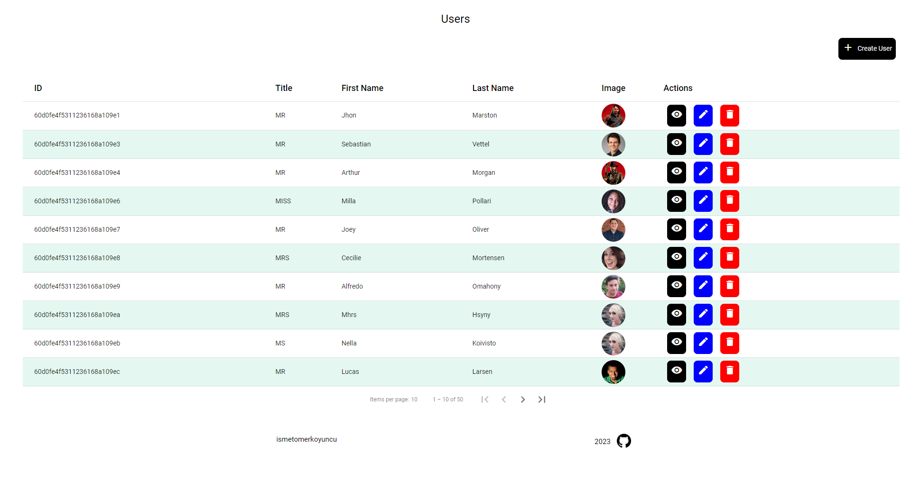

# CrudAngular

This project was generated with [Angular CLI](https://github.com/angular/angular-cli) version 14.2.13.

[Live Version](https://crud-angular-iomerkoyuncu.netlify.app/)

## Install dependencies

Run `npm install` to install all dependencies.

## Dependencies

- [Angular Material](https://material.angular.io/)
- [Ngx Toastr](https://www.npmjs.com/package/ngx-toastr)

## Development server

Run `ng serve` for a dev server. Navigate to `http://localhost:4200/`. The application will automatically reload if you change any of the source files.

